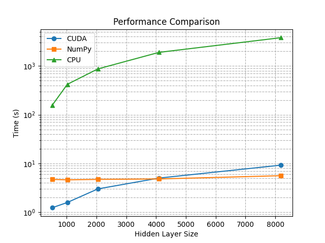

In this project numpy(on cuda), C code on CUDA and on CPU are compared in the task of classification for MNIST dataset. MLP architecture is used as it is a building block for other types of neural networks.

For the matMul and Softmax naive and more advanced kernels were implemented and compared in speedup.

There is a 1.6x speedup for the matMul and 16x speedup for the softmax.

Here is the plot for comparing performance on MNIST. For the training all models had batch size equal to 32 and 10 epochs.

As the model has only 2 hidden layers, the numbers approximately show the number of weights.
